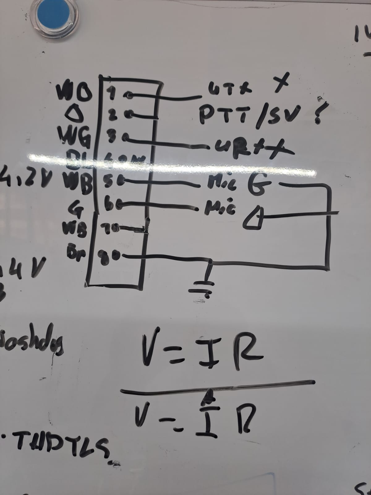
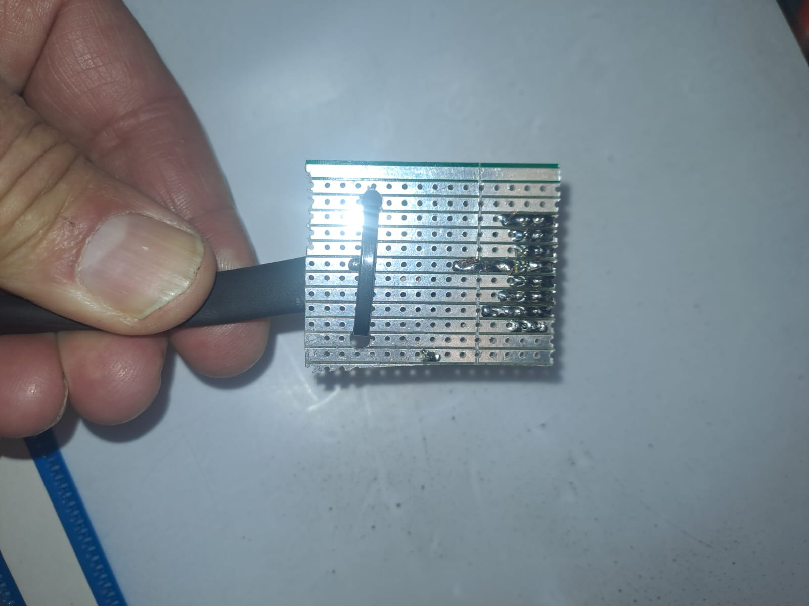
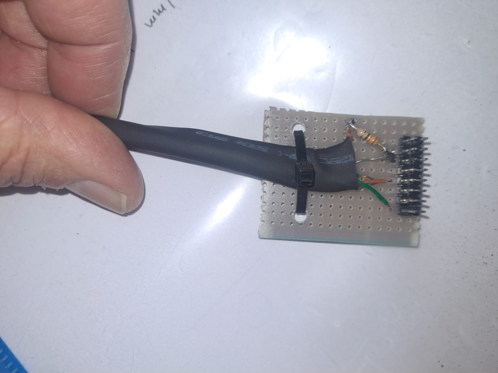

# Cable-Assemblies
This the repository of the cable asemblies
## Cable index 
1) Anytone At779UV to Radio interface R1
   Cable asembly connection
  
    
3) Strip PCB asembly
  
4) Strip PCB at botom
   
   
